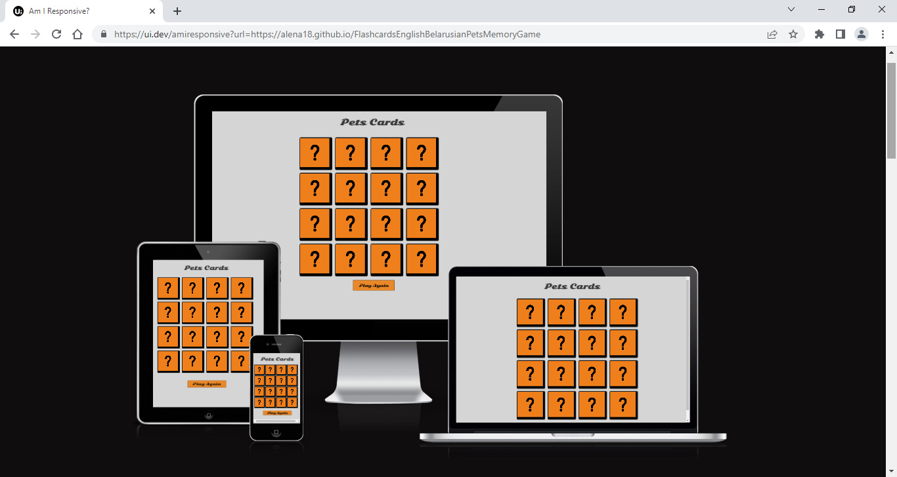
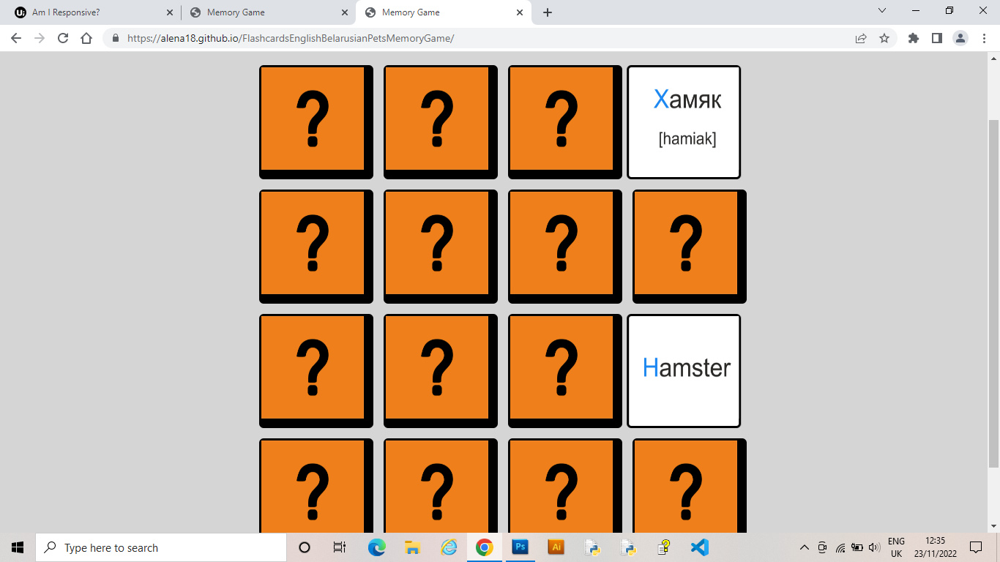
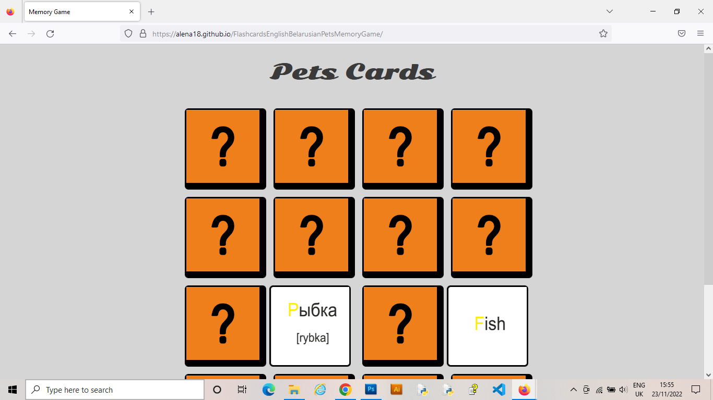
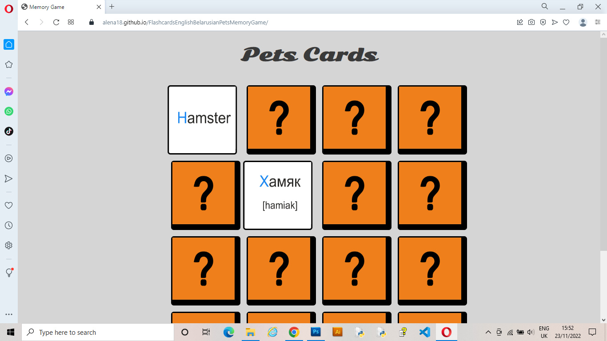
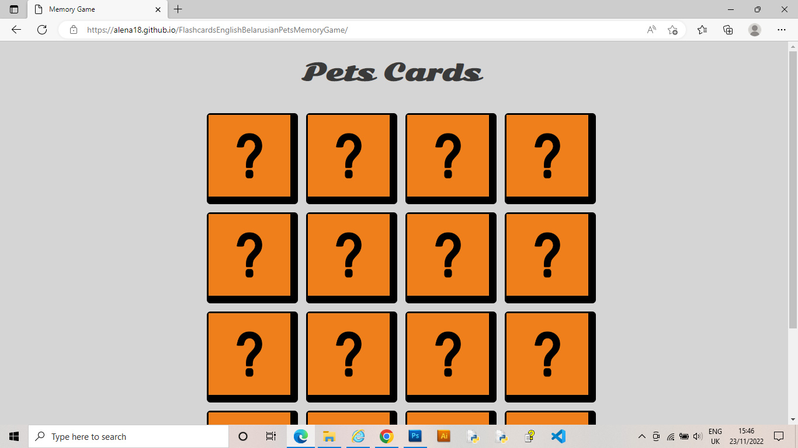
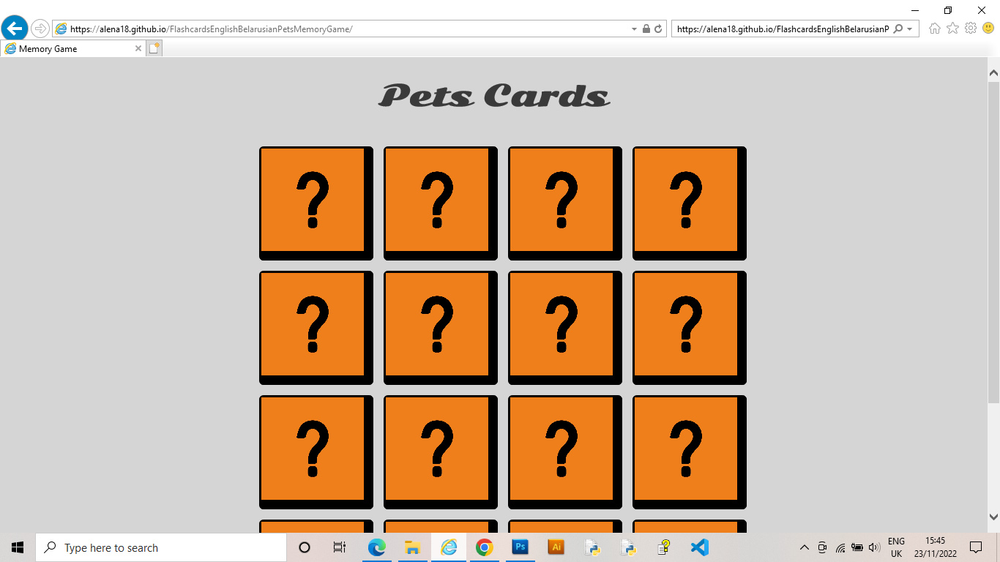
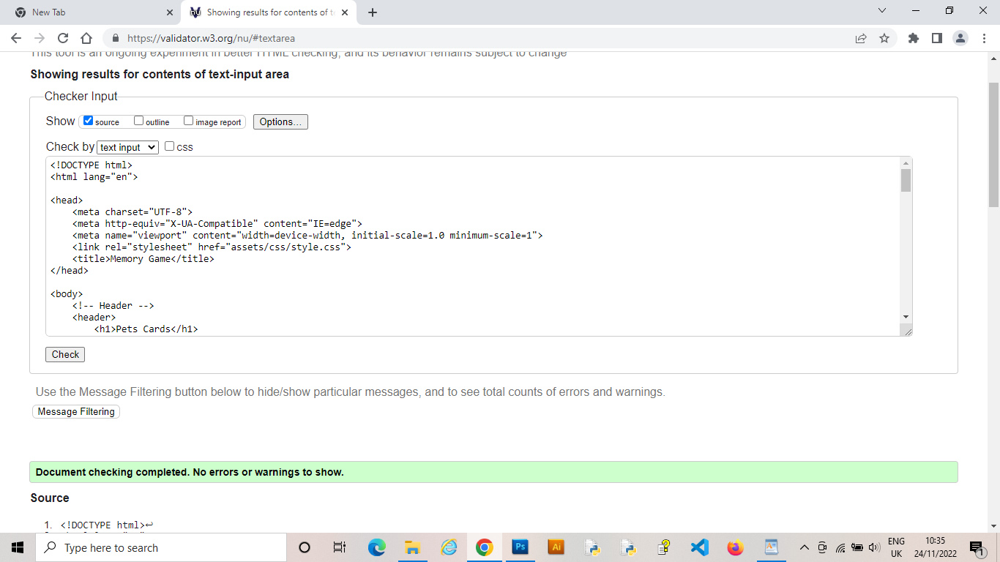
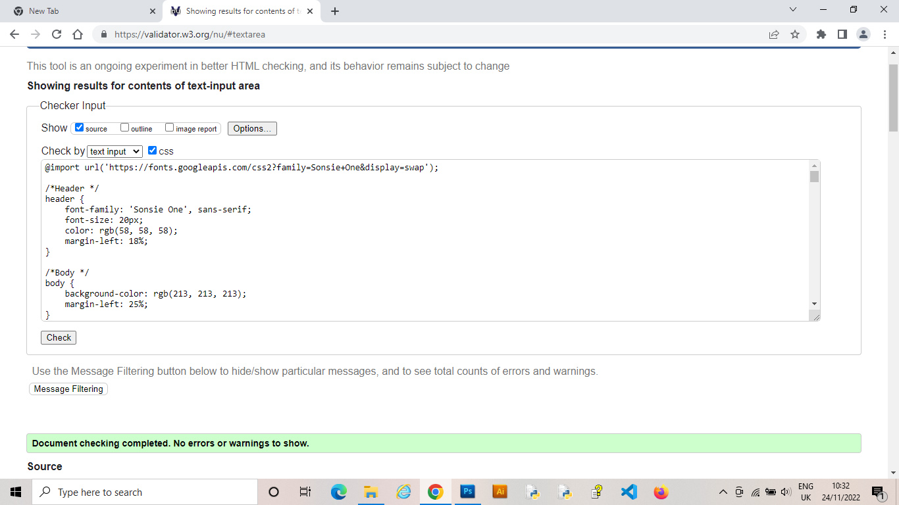

# FlashcardsEnglishBelarusianPetsMemoryGame
The live link can be found [here](https://alena18.github.io/FlashcardsEnglishBelarusianPetsMemoryGame/)

Flashcards English Belarusian Pets Memory Game
Flashcards English Belarusian Pets Memory Game is the site that represents a flashcard game.The aim of this game is to match pairs of cards in different language (Belarusian-English). Click on a card in the interactivity to turn it over. Then click on another one. If the two cards match, they will stay face-up. If the two cards do not match, they will return to being face-down. The game ends when all the cards have been matched in pairs.It should help learner who study English and Belarusian languages to remember the name of the pets in both languages.

## Features 
There are  View Work LinkedIn Resumé buttons that help customers to reach me. View Work page contain gallery of my portfolio samples. LinkedIn connect to my LinkedIn page where customers can find extra information about me, they also can download my CV through Resumé link. Every page also has my email contact, while clicking it will connect to email page. Also, Hire Me button brings to sign up form that helps customers to reach me.

## Testing 

I tested this pages work in different browser : Chrome, Firefox, Opera, Microsoft Edge, Internet Explore.

I tested pages using Lighthouse in chrome developer tool.

And Am I responsive (https://ui.dev/amiresponsive) pages.

All the test showed a good results

### Validator Testing 

- HTML
  - only 'section' remark was return as a notice no errors were returned when passing through the official 

  
  
- CSS
  - No errors were found when passing through the official

  

- Javascript
  - No errors were found when passing through the official

  

### Unfixed Bugs

no unfixed bug left

## Deployment

The site was deployed to GitHub pages. The steps to deploy are as follows: 
  - In the [GitHub repository](https://github.com/Alena18/FlashcardsEnglishBelarusianPetsMemoryGame), navigate to the Settings tab 
  - From the source section drop-down menu, select the **Main** Branch, then click "Save".
  - The page will be automatically refreshed with a detailed ribbon display to indicate the successful deployment.

The live link can be found [here](https://alena18.github.io/FlashcardsEnglishBelarusianPetsMemoryGame/)

### Local Deployment

In order to make a local copy of this project, you can clone it. In your IDE Terminal, type the following command to clone my repository:

- `git clone https://github.com/Alena18/FlashcardsEnglishBelarusianPetsMemoryGame.git`

Alternatively, if using Gitpod, you can click below to create your own workspace using this repository.

## Credits 

I have used my knowledge that I gain from CodeInstitute tutorial and my mentor . Thank you for a great experience. 

### Content 

- The text and all pages are from my own experience. 

### Media

- The code for font was taken from google fonts website https://fonts.google.com/

Thank you for your time, hope you enjoy my README.